 # Lil Mart

## Sobre o Lil Mart
O Lil Mart é um projeto que busca tornar mais acessível as venda de produtos online para pequenos mercados, de forma que eles consigam expandir a sua área de atuação para muito além de seu próprio bairro.

## Funcionalidades

- Cadastro e login de usuários e mercados
- Busca de produtos por nome
- Visualização de detalhes dos produtos
- Gerenciamento de produtos para mercados (criar, editar, inativar)
- Carrinho de compras para usuários
- Interface responsiva e intuitiva

## Tecnologias Utilizadas

- React
- JavaScript e TypeScript
- React Router DOM
- Axios
- @tanstack/react-query
- FontAwesome
- CSS Modules

## Estrutura do Projeto

```
lil-mart/
  src/
    api/
    assets/
    components/
    features/
    pages/
    App.js
    index.js
    ...
  public/
    index.html
    ...
  README.md
  package.json
  ...
```

## Como Executar

1. Instale as dependências:
   ```sh
   npm install
   ```

2. Inicie o projeto:
   ```sh
   npm start 

## Instrução de uso
1. Tela inicial do Lil Mart. 
No canto superior direito você tem a opção de entrar na sua conta ou criar uma nova.
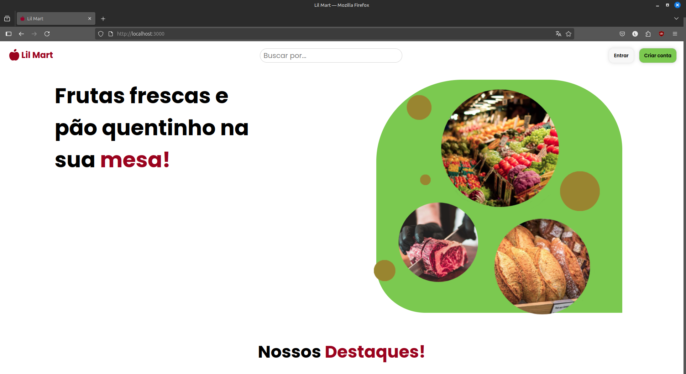

2.1 Tela para escolher o tipo de conta a ser criada
Ao clicar em "Criar conta", você será redicionado para essa tela, onde poderá escolher se a nova conta será de usuário ou mercado.
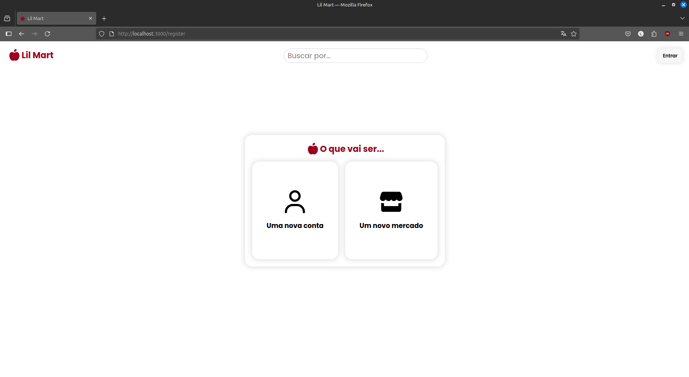

2.2 Tela para cadastro de usuário
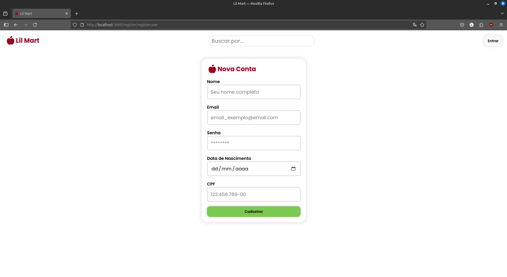

2.3 Tela para cadastro de usuário
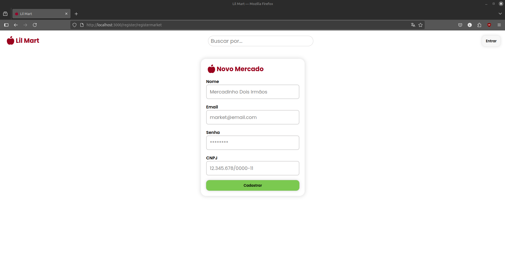

3. Tela para login
Com a conta criada agora você poderá logar
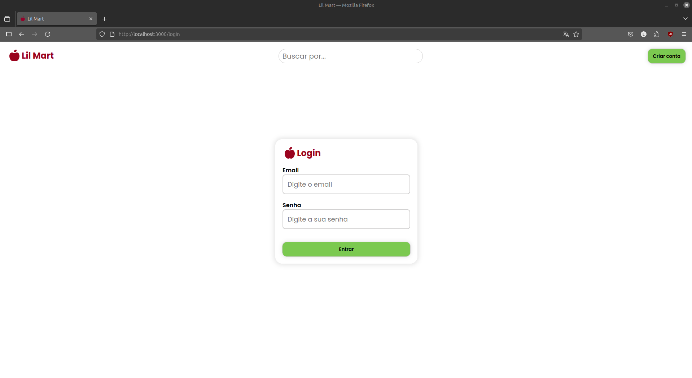

4. Tela Inicial do Mercado
4.1 Nessa tela é possível ver quais produtos um mercado já tem cadastrado
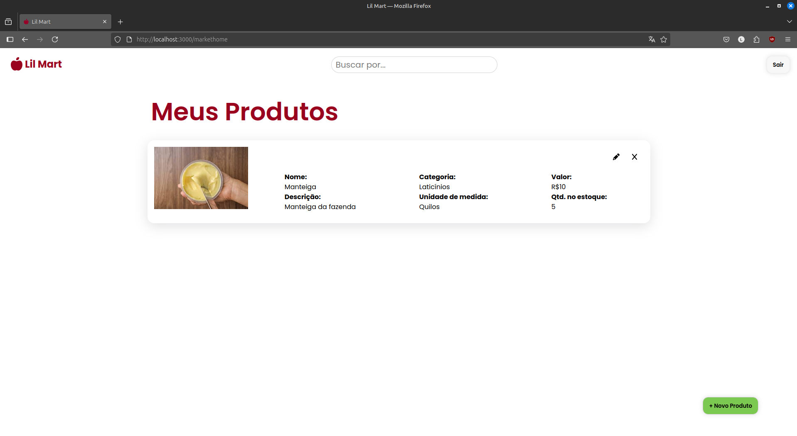

4.2 Cadastrar novos produtos
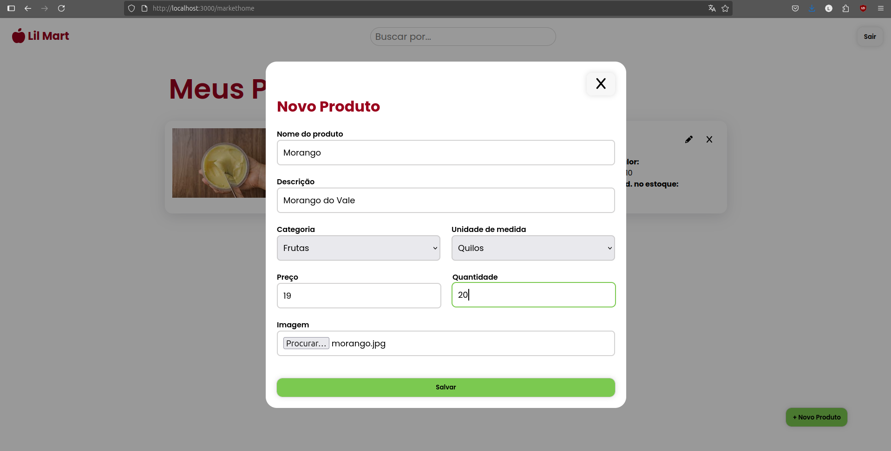
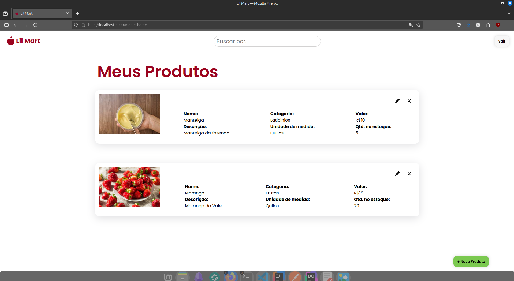

4.3 Editar um produto já existente
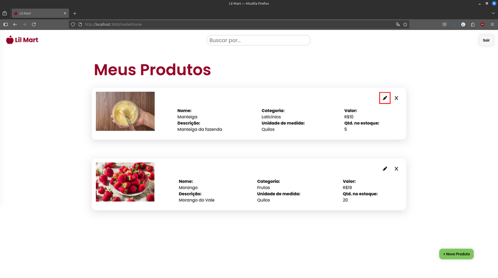
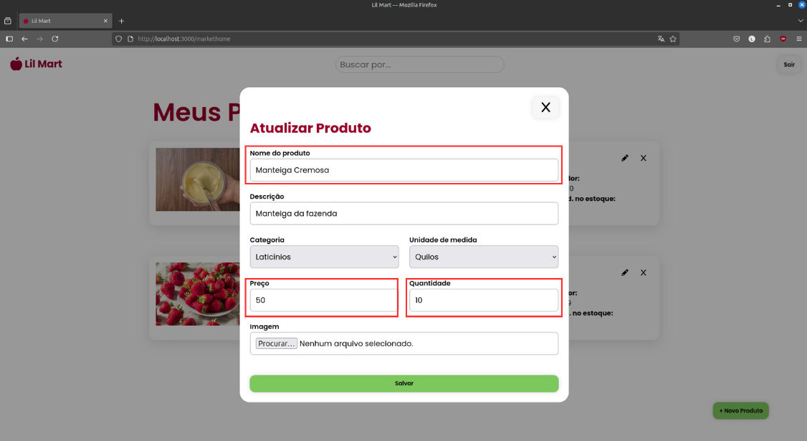
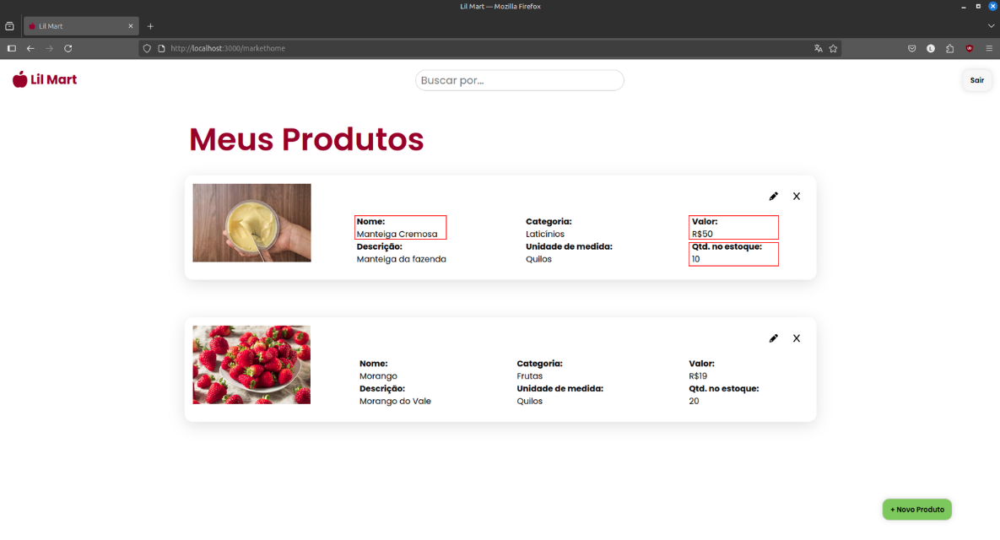


4.4 Inativar um produto em específico
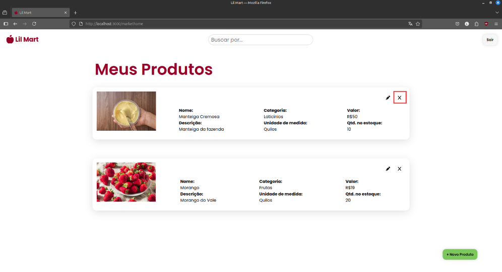

